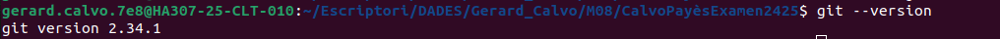
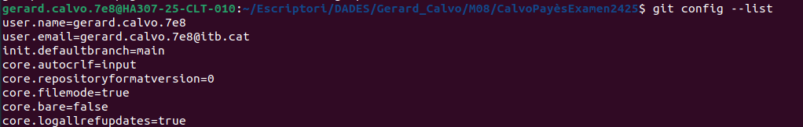
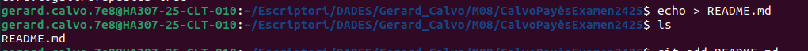
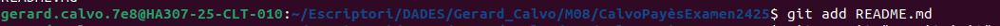
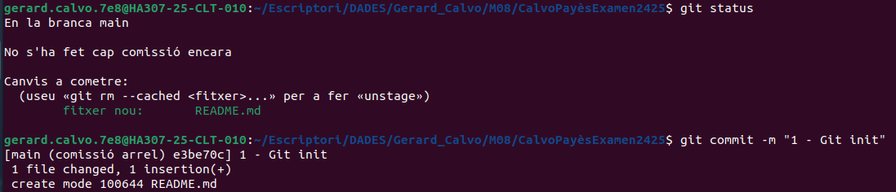
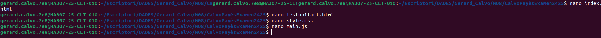

### **Examen - RA6: Creació i Gestió d'un Projecte Web amb Git i Desplegament en Vercel**

---
### **Objectiu**  
Crear un projecte web amb documents HTML, CSS i JavaScript. 
Gestionar amb Git, utilitzar branques i publicar un projecte.

#### **1. Configuració inicial**

1. Comprova la versió instal·lada de Git, fes captura del terminal.

3. Mostra la configuració actual per verificar-ho, fes captura del terminal. Explica com veig que he configurat correctament el email i el nom.

5. Inicia un nou repositori Git al directori de treball on consideris. El nom del directorio ha de ser `Cognom1Cognom2Examen2425`.
-- No he fet captura al iniciar el repositori git. Pero ho he fet.
6. Crea un document README.md, afegeix el document i fes un primer commit que amb el missatge `1 - Git init`

---

#### **2. Creació del projecte web**

1. **Crea els fitxers següents al directori del projecte:**  
   - `index.html`
   - `testunitari.html`
   - `style.css`  
   - `main.js`
   

2. Afegeix contingut bàsic a cada fitxer.

---

#### **3. Gestió amb Git**

1. **Afegir fitxers:**  
   - Utilitza un patró d'expressió regular per afegir tots els fitxers `.html` i `.css`. Fes captura del terminal   

2. **Verifica l'estat del repositori, fes captura del terminal**  

3. **Elimina `testunitari.html` del staging**  

4. **Fes un commit que amb el missatge '2- Estructura bàsica'**  
 
5. **Consulta l'historial de commits, fes captura del terminal.**  
---

#### **4. Creació de branques i documentació**

1. **Crea una nova branca per a la documentació** 

2. **Crea un fitxer `README.md` si es necessari:**  
   - Explica dins del fitxer el propòsit del projecte.  

3. **Afegeix i fes commit dels canvis a la branca `documentacio`.**
El missatge del commit ha de ser "3 - README.md amb documentació inicial"

4. **Torna a la branca principal (`main`) i fes un merge** 
   
---

#### **5. Remot i publicació**

1. Configura un remot per al repositori que has de crear en GitHub, el nom del repositorio de GitHub ha de ser `Cognom1Cognom2Examen2425`. Fes captura al terminal de com has configurat el repositori remot.

2. **Puja els canvis al remot desde terminal**.Fes captura al terminal.

4. **Publica el projecte a Vercel i indica l'enllaç en el document Markdown del examen.**
